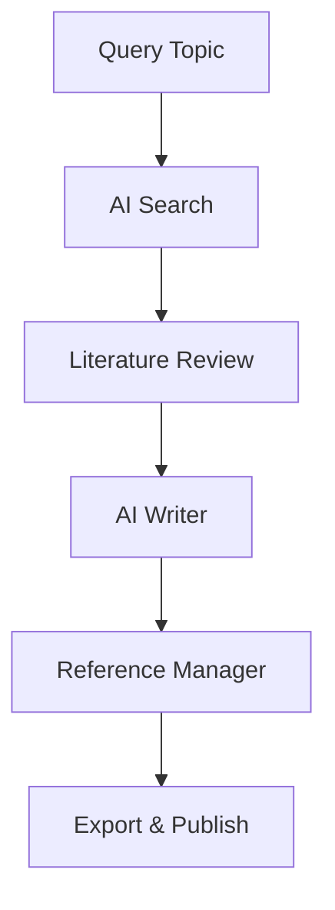

## Overview

Paperguide provides an all-in-one AI research assistant to streamline your academic and professional workflows. You can search for papers, analyze literature, generate academic writing, and manage references efficiently. These core features help you save time and focus on insights.

<Callout kind="info">
  Start by signing up at https://paperguide.ai and exploring the dashboard to access all tools.
</Callout>

## Key Features

Discover the essential capabilities through these feature highlights.

<Columns cols={2}>
  <Card title="AI-Powered Paper Search" icon="search" href="https://paperguide.ai/#ai-search">
    Find relevant research papers instantly using natural language queries. Get summaries, key findings, and direct links to full texts.
  </Card>
  <Card title="Literature Review Assistance" icon="book-open" href="https://paperguide.ai/#literature-review">
    AI analyzes multiple papers to identify themes, gaps, and connections. Generate structured reviews in minutes.
  </Card>
  <Card title="AI Writing Tools" icon="edit-3" href="https://paperguide.ai/writer/">
    Draft sections like abstracts, introductions, and discussions with context-aware suggestions tailored for academia.
  </Card>
  <Card title="Reference Management" icon="bookmark" href="https://paperguide.ai/references/">
    Organize citations, export in various formats, and integrate with tools like Zotero or EndNote.
  </Card>
</Columns>

## Research Workflow

Follow this simple process to leverage Paperguide's features effectively.

<Steps>
  <Step title="Search Papers" icon="search">
    Enter your query in the AI search bar.

    ```
    Example: "machine learning applications in drug discovery"
    ```
  </Step>
  <Step title="Analyze Literature" icon="bar-chart">
    Select papers and run literature review to extract insights.
  </Step>
  <Step title="Write with AI" icon="edit">
    Use the writer tool to generate content based on your analysis.
  </Step>
  <Step title="Manage References" icon="save">
    Add to library and export citations.
  </Step>
</Steps>



## Feature Comparisons

Choose the right tool for your needs across different scenarios.

<Tabs>
  <Tab title="Quick Search" icon="zap">
    Ideal for finding single papers fast.

    <Callout kind="tip">
      Use precise queries for `<5s` results.
    </Callout>
  </Tab>
  <Tab title="Deep Analysis" icon="activity">
    Perfect for systematic reviews involving 50+ papers.

    **Benefits:**
    - Theme extraction
    - Gap identification
    - Citation networks
  </Tab>
  <Tab title="Writing Assistance" icon="pen-tool">
    Supports full paper drafting.

    <Expandable title="Citation Formats" default-open="true">
      Export as:

      ```bibtex
      @article{example2023,
        title={Sample Paper},
        author={Doe, John},
        journal={Journal of Research},
        year={2023}
      }
      ```

      Or APA, MLA via one-click.
    </Expandable>
  </Tab>
</Tabs>

## Best Practices

- Combine search with literature review for comprehensive insights.
- Always verify AI-generated content against original sources.
- Use reference manager integrations for seamless workflows.

<Callout kind="success">
  Ready to dive deeper? Check the [Quickstart](/quickstart) guide or [Authentication](/authentication) for API access.
</Callout>