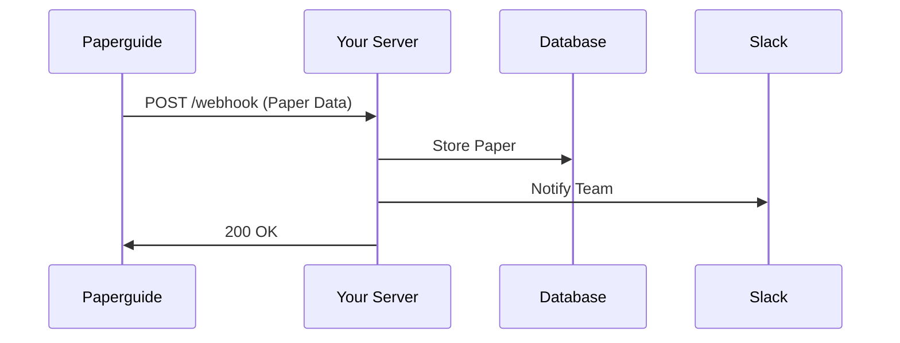

## Overview

Paperguide supports seamless integrations with popular citation managers, webhook endpoints, and third-party services. These connections enable you to export research data, automate workflows, and incorporate Paperguide into your existing toolchain. Whether you manage references in Zotero or trigger actions via Zapier, these features save time and reduce manual effort.

<Callout kind="tip">
Start with exporting citations for quick wins, then explore webhooks for advanced automation.
</Callout>

## Export to Citation Managers

Export your literature reviews and references directly from Paperguide to popular tools. This keeps your research organized across platforms.

<Tabs>
  <Tab title="Zotero" icon="book-open">

    Follow these steps to export:

    <Steps>
      <Step title="Select Papers" icon="search">
        In your Paperguide dashboard, select the papers from your search or review.
      </Step>
      <Step title="Choose Export" icon="download">
        Click the export button and select `Zotero` format (RIS or BibTeX).
      </Step>
      <Step title="Import to Zotero">
````bash
# Drag the .ris file into Zotero or use File > Import
# Zotero automatically parses citations, DOIs, and abstracts
````
      </Step>
    </Steps>

  </Tab>
  <Tab title="Mendeley" icon="users">

    Mendeley supports BibTeX exports natively.

    <Steps>
      <Step title="Generate BibTeX">
        From Paperguide, export as BibTeX.
      </Step>
      <Step title="Import">
````bash
# In Mendeley Desktop: File > Import > BibTeX
# Web: Watch Folder or direct upload
````
      </Step>
    </Steps>

  </Tab>
</Tabs>

## Webhooks for Automation

Set up webhooks to receive real-time notifications when new papers match your criteria or reviews complete. Configure them in your Paperguide settings under `Integrations > Webhooks`.

### Webhook Payload Example

Paperguide sends POST requests to your endpoint.

<Response tabs="Success,Error" show-lines="false">
```json
{
  "event": "paper_matched",
  "data": {
    "id": "paperguide_123",
    "title": "AI in Drug Discovery",
    "doi": "10.1234/example",
    "authors": ["Smith J", "Doe A"],
    "abstract": "Summary text...",
    "url": "https://api.example.com/papers/paperguide_123"
  },
  "timestamp": "2024-10-15T10:00:00Z"
}
```

```json
{
  "error": "validation_failed",
  "message": "Invalid search criteria",
  "timestamp": "2024-10-15T10:00:00Z"
}
```
</Response>

### Handling Webhooks

<CodeGroup tabs="Node.js,Python">
```javascript
const express = require('express');
const app = express();
app.use(express.json());

app.post('/webhook/paperguide', (req, res) => {
  const { event, data } = req.body;
  if (event === 'paper_matched') {
    // Add to your database or notify team
    console.log(`New paper: ${data.title}`);
  }
  res.status(200).json({ received: true });
});

app.listen(3000);
```

```python
from flask import Flask, request, jsonify

app = Flask(__name__)

@app.route('/webhook/paperguide', methods=['POST'])
def webhook():
    data = request.json
    event = data.get('event')
    if event == 'paper_matched':
        print(f"New paper: {data['data']['title']}")
    return jsonify({'received': True}), 200

if __name__ == '__main__':
    app.run(port=3000)
```
</CodeGroup>

<ParamField header="Paperguide-Signature" param-type="string" required="true">
  HMAC SHA-256 signature for verification. Compute using your webhook secret.
</ParamField>



## Third-Party Connections

Connect Paperguide to no-code tools for extended functionality.

<Columns cols={3}>
  <Card title="Zapier" icon="zap" href="https://zapier.com" target="_blank">
    Trigger Zaps on new papers. No coding required.
  </Card>
  <Card title="Slack" icon="message-circle" href="https://slack.com" target="_blank">
    Send paper alerts to channels via webhooks.
  </Card>
  <Card title="Notion" icon="book-open" href="https://notion.so" target="_blank">
    Auto-populate databases with citations.
  </Card>
</Columns>

## Custom Integrations and Best Practices

<Expandable title="Advanced: Custom API Integration" default-open="false">

Build direct API calls to Paperguide endpoints.

```javascript
const response = await fetch('https://api.example.com/v1/papers/search', {
  method: 'POST',
  headers: { 'Authorization': 'Bearer YOUR_API_KEY' },
  body: JSON.stringify({ query: 'AI drug discovery' })
});
const papers = await response.json();
```

</Expandable>

<Callout kind="alert">
Always verify webhook signatures to prevent unauthorized access. Store secrets securely and rotate them regularly.
</Callout>

<ExpandableGroup>
  <Expandable title="Troubleshooting Integrations" default-open="true">
    - Check webhook logs in Paperguide dashboard.
    - Ensure your endpoint responds with 2xx status within 5 seconds.
    - Test exports with sample data first.
  </Expandable>
</ExpandableGroup>